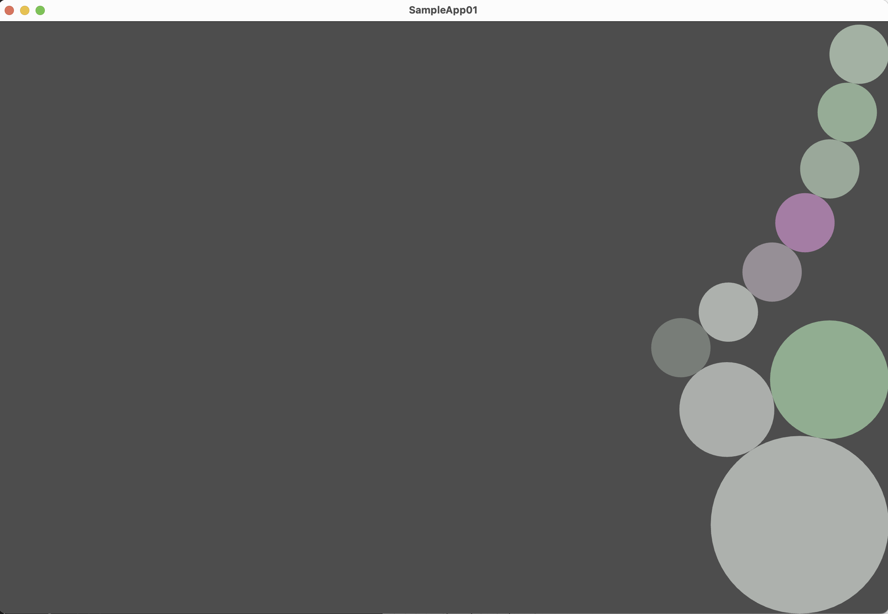

# RigidBodySimulationBasics
Sample programs accompanying to [the blog articles on Medium](https://medium.com/@e92rodbearings/rigid-body-simulation-basics-part-1-from-newtons-law-to-a-constrained-optimization-problem-fc3b2148ad5d).

It demonstrates how the velocity-space constraint-based physics simulation works for the 2-dimensional linear motions.

<a href="pics/ios_capture.png"> </a>
<a href="pics/linux_capture.png"> </a>

# Supported Environments
 
* Linux (tested on Ubuntu 22.04.3 & Intel Core i5/Intel 640, actually an old MacbookPro)

* iOS (tested on iPhone 13 mini & iOS 16.6)

# Installation on Linux

## Prerequisites.
[GLM](https://glm.g-truc.net/0.9.9/), 
[GLEW](https://glew.sourceforge.net), 
and [GLFW](https://www.glfw.org), and their dependent packages must be installed.

Following is a sample installation process tested on Ubuntu 22.04.3.
```
$ sudo add-apt-repository universe
$ sudo add-apt-repository multiverse
$ sudo apt update

$ # The following three lines are apparently needed to make 'sudo apt-get build-dep' work.
$ # Ref: https://askubuntu.com/questions/496549/error-you-must-put-some-source-uris-in-your-sources-list
$ cat /etc/apt/sources.list | grep deb-src
$ sudo sed -i~orig -e 's/# deb-src/deb-src/' /etc/apt/sources.list
$ sudo apt-get update

$ sudo apt install build-essential
$ sudo apt install cmake
$ sudo apt-get build-dep libglfw3
$ sudo apt-get build-dep libglew-dev
$ sudo apt install libglew-dev
$ sudo apt install libglm-dev
$ sudo apt install libglfw3
$ sudo apt install libglfw3-dev
```

## NOTE on Macos.
It works for Macos at the time of writing (Aug 2023) with the following extra step for GLFW.
The [GLM](https://formulae.brew.sh/formula/glm) and [GLEW](https://formulae.brew.sh/formula/glew#default)
can be installed by Homebrew.
However, GLFW installed by Homebew does not seem to work for me, and I had to manually build it.
(The glfwCreateWindow() returns nullptr when it is linked with Homebrew's glfw library.)
Following is the instruction I followed.

```
$ cd <path/to/>/SampleApp01/LinuxOpenGL
$ git clone https://github.com/glfw/glfw.git
$ cd glfw
$ mkdir build
$ cd build
$ cmake .. 2>&1 | tee cmake_console_out.txt
$ VERBOSE=1 make 2>&1 | tee make.log
$ VERBOSE=1 sudo make install 2>&1 | tee make_install.log

```
The [CMakeLists.txt](SampleApp01/SampleApp01/LinuxOpenGL/CMakeLists.txt) assumes this locally built GLFW for Macos.

## Build
The sample program `sample_app_01` is built with the following standard CMake process.

```
$ cd <path/to>/SampleApp01/SampleApp01/LinuxOpenGL
$ mkdir build
$ cd build
$ cmake ..
$ make VERBOSE=1
$ ./sample_app_01
```

## Installation for iOS

Plug an iOS device in to your Mac,
open [SampleApp01.xcodeproj](SampleApp01/SampleApp01.xcodeproj/) with XCode, build, and run.
It's been tesetd on Mac mini M1 2020, Ventura 13.5, and XCode 14.3.1.

# Usage

On iOS App, tilt the device to let the balls roll according to the gravity.
On Linux, the location of the cursor relative to the center of the window defines the gravity applied to the balls.
The 7 small balls are linked together like a chain. The slider *Torsional Spring Strengh* controls the forces applied to the 7 balls, which makes the chain act like a pool noodle.
On Linux the strengh is controled by the arrow keys.


# License
GPL v3

# Contact
Shoichiro Yamanishi ( e92rodbearings @ gmail . com )
